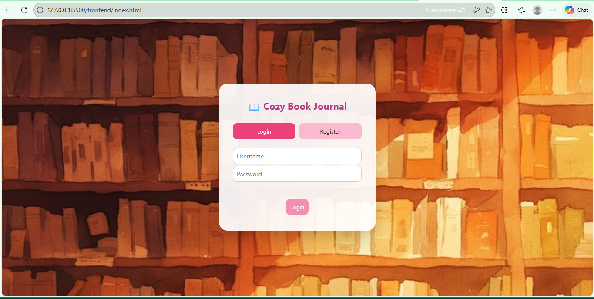
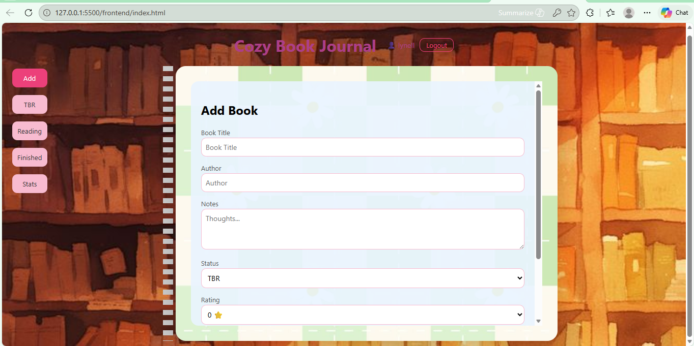
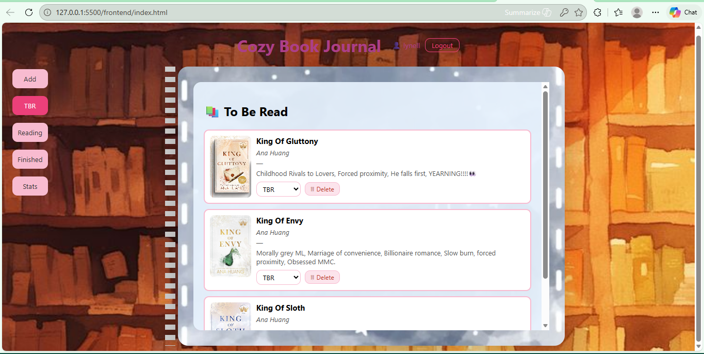
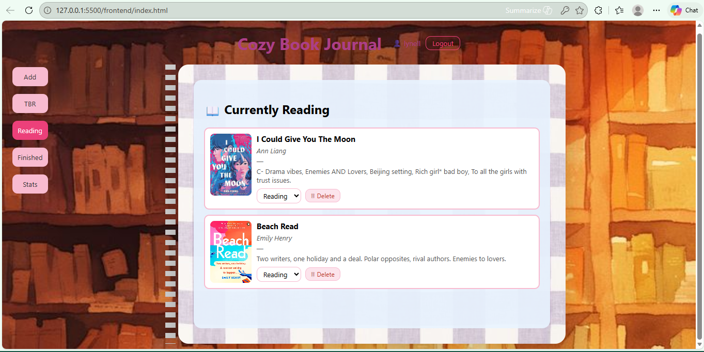
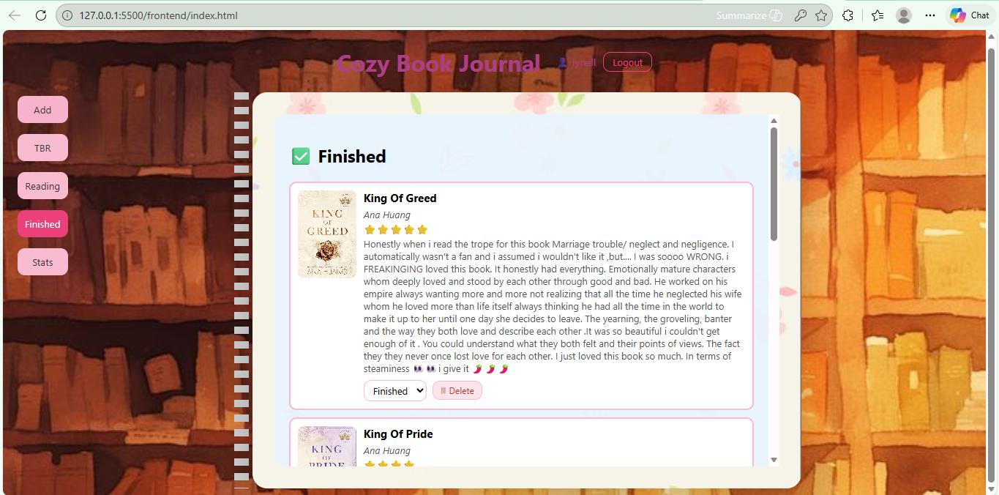
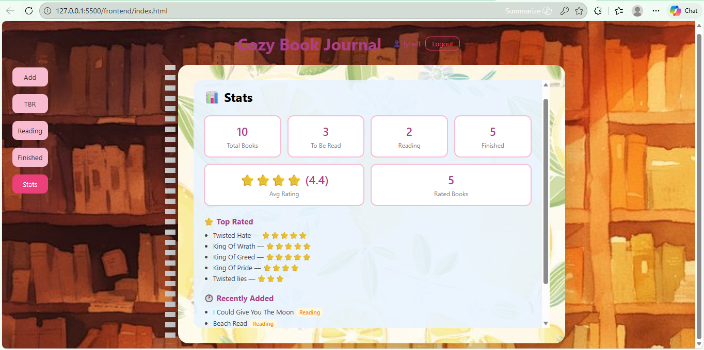

# 📖 Cozy Book Journal

A full stack book tracking web app built with **Django REST Framework** and **Vanilla JavaScript**. Users can create accounts, log in, and manage their personal reading lists across three categories — To Be Read, Currently Reading, and Finished.

---

## 🌸 Screenshots

### Login & Register


### Add a Book


### To Be Read


### Currently Reading


### Finished Books


### Stats


---

## ✨ Features

- 🔐 Multi-user authentication with JWT (JSON Web Tokens)
- 📚 Add books with title, author, notes, star rating and cover image
- 📋 Organise books into TBR, Reading and Finished lists
- 🔄 Change a book's status directly from any list
- 🗑 Delete books
- 📊 Stats page showing totals, average rating, top rated and recently added books
- 🔒 Each user only sees their own books
- 🔁 Auto token refresh — stays logged in for 7 days

---

## 🛠 Tech Stack

| Layer | Technology |
|-------|-----------|
| Frontend | HTML, CSS, Vanilla JavaScript |
| Backend | Python, Django, Django REST Framework |
| Authentication | JWT via djangorestframework-simplejwt |
| Database | SQLite |
| CORS | django-cors-headers |

---

## 🚀 How to Run Locally

### 1. Clone the repository
```bash
git clone https://github.com/LynellGovender/Cozy-book-journal.git
cd Cozy-book-journal
```

### 2. Install backend dependencies
```bash
cd backend
pip install -r requirements.txt
```

### 3. Set up the database
```bash
python manage.py makemigrations books
python manage.py migrate
```

### 4. Start the backend server
```bash
python manage.py runserver
```

### 5. Open the frontend
Open `frontend/index.html` with a Live Server extension (e.g. VS Code Live Server) at:
```
http://127.0.0.1:5500
```

### 6. Register and log in
Create a free account on the register screen and start tracking your books!

---

## 📁 Project Structure

```
cozy-book-journal/
├── frontend/
│   ├── index.html        # App structure
│   ├── script.js         # API calls, auth, UI logic
│   ├── style.css         # All styling
│   └── images/           # Background and book cover images
├── backend/
│   ├── books/
│   │   ├── models.py     # Book database model
│   │   ├── serializers.py # Data validation and conversion
│   │   ├── views.py      # API endpoints
│   │   └── urls.py       # URL routing
│   ├── config/
│   │   ├── settings.py   # Django configuration
│   │   └── urls.py       # Root URL config
│   └── requirements.txt
└── screenshots/
```

---

## 🔌 API Endpoints

| Method | Endpoint | Description |
|--------|----------|-------------|
| POST | `/api/auth/register/` | Create a new account |
| POST | `/api/auth/login/` | Login and receive JWT tokens |
| POST | `/api/auth/refresh/` | Refresh access token |
| GET | `/api/books/` | Get all your books |
| GET | `/api/books/?status=TBR` | Filter books by status |
| POST | `/api/books/` | Add a new book |
| PATCH | `/api/books/<id>/` | Update a book |
| DELETE | `/api/books/<id>/` | Delete a book |
| GET | `/api/stats/` | Get your reading statistics |

---

## 👩‍💻 Author

**Lynell Govender**  
[GitHub](https://github.com/LynellGovender)
